# LIDIA
[Arxiv](https://arxiv.org/pdf/1911.07167.pdf) | [CVF (pdf)](http://openaccess.thecvf.com/content_CVPRW_2020/papers/w31/Vaksman_LIDIA_Lightweight_Learned_Image_Denoising_With_Instance_Adaptation_CVPRW_2020_paper.pdf) | [CVF (suppl)](http://openaccess.thecvf.com/content_CVPRW_2020/supplemental/Vaksman_LIDIA_Lightweight_Learned_CVPRW_2020_supplemental.pdf)
### Official pytorch implementation of the paper: "LIDIA: Lightweight Learned Image Denoising with Instance Adaptation"
####  NTIRE 2020

## Image denoising with *adaptation*
LIDIA is a lightweigh denoising network that can adapt itself to the input image, for example:  

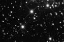  
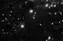 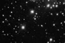  
&ensp; clean astronomical image &emsp; &emsp; &ensp; noisy with &sigma; = 50 
&emsp; &emsp; &ensp; denoised, PSNR = 24.33dB &ensp; adaptation, PSNR = 26.25dB

# Lightweight Image Denoiser
## The Denoising Scheme
Our proposed method extracts all possible overlapping patches of size √n × √n from the processed image;
augment the patches with their nearest neighbors and cleans each patch in a similar way. 
The final reconstructed image is obtained by combining these restored patches via averaging. 

<p align="center">
  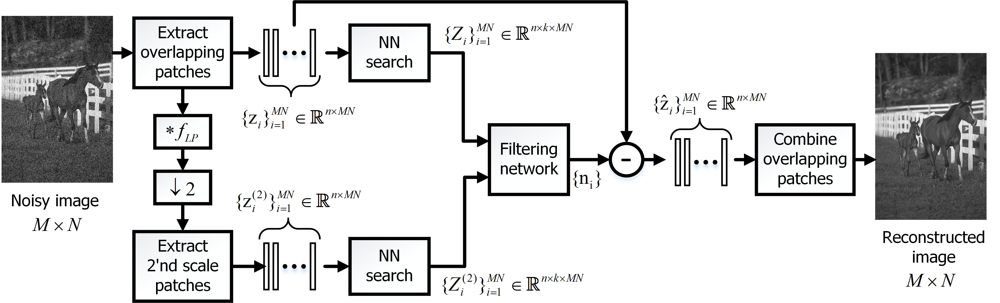  
</p>
The proposed scheme includes a multi-scale treatment, fusing the processing of corresponding patches from different scales.

## Results
Our network achieves near-SOTA results while using a very small number of parameters to be tuned. 
Comparison between our algorithm and leading alternative ones by presenting their PSNR versus 
their number of trained parameters shows that our networks, both LIDIA and LIDIA-S (LIDIA small), 
achieve the best results among the lightweight networks.

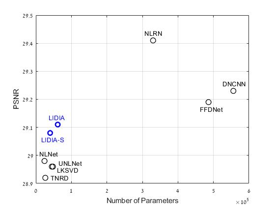  
 
&emsp; &emsp; &emsp; **Comparing denoising networks: PSNR performance vs. the number** 
<br /> &emsp; &emsp; &emsp; **of trained parameters (garyscale images, σ = 25)**

### Color denoising performance on BSD68 image set

| Noise Level | BM3D | FFDNet  | DnCNN | NLNet |  LIDIA (ours) |
|:-------:|:-------:|:-------:|:-------:|:-------:|:-------:|
|   15        | 33.50 | 33.87 |   33.99   | 33.81 | **34.03** |
|   25        | 30.68 | 31.21 | **31.31** | 31.08 | **31.31** |
|   50        | 27.36 | 27.96 | **28.01** | 27.73 |   27.99   |
| **Average** | 30.51 | 31.01 |   31.10   | 30.87 | **31.11** |  

Best PSNR marked in **bold**.

### Some Qualitative Results

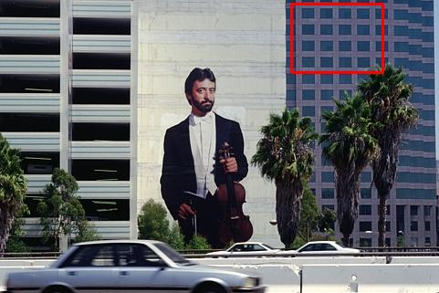 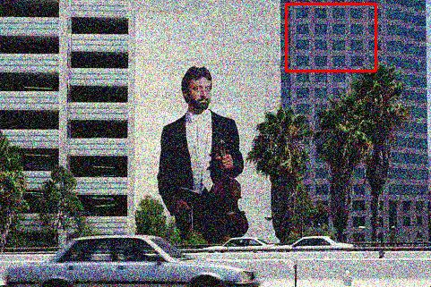 
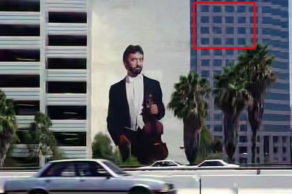 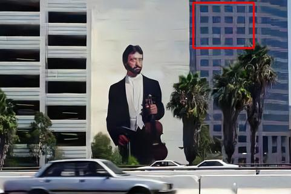 
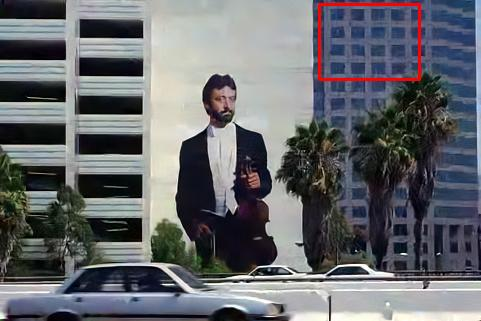 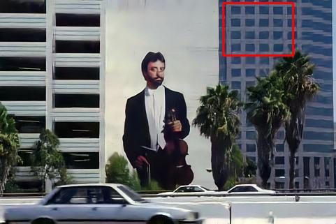
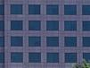 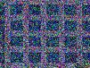 
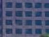 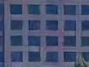 
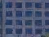 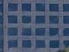  
&emsp; &emsp; clean &emsp; &emsp; &emsp; noisy with &sigma; = 50 &emsp; &emsp; &ensp; BM3D &emsp; &emsp; &emsp; &emsp; &nbsp; DnCNN 
&emsp; &emsp; &emsp; &emsp; &nbsp; NLNet &emsp; &emsp; &emsp; &nbsp; LIDIA (ours) 
<br /> &emsp; &emsp; &emsp; &emsp; &emsp; &emsp; &emsp; &emsp; &emsp; &emsp; &emsp; &emsp; &emsp; &emsp;
PSNR = 26.98dB &emsp; PSNR = 27.81dB &emsp; PSNR = 27.41dB &emsp; PSNR = 27.79dB

# Instant Adaptation

We present a technique for updating the network for better treating the incoming image. This adaptation becomes highly effective
in cases of images deviating from the natural image statistics, or in situations in which the incoming image exhibits stronger inner-structure. In these cases,
denoising results are boosted dramatically, surpassing known supervised deep-denoisers.

<p align="center">
  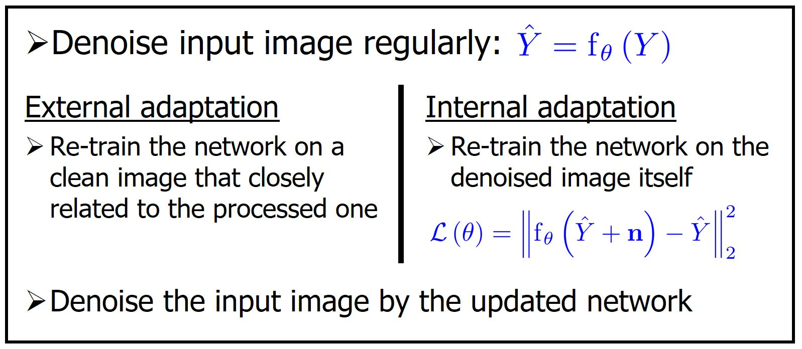 
</p>

## External Adaptation Results

The external adaptation is useful when the input image deviates from the statistics of the training images.
In examples above the network was retrained on the image in the left column (marked as *training image*)

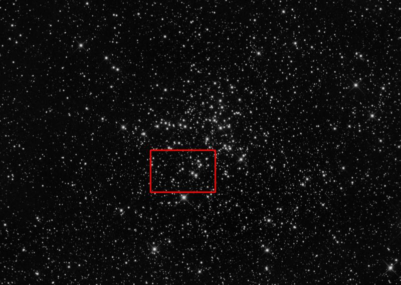 &ensp; 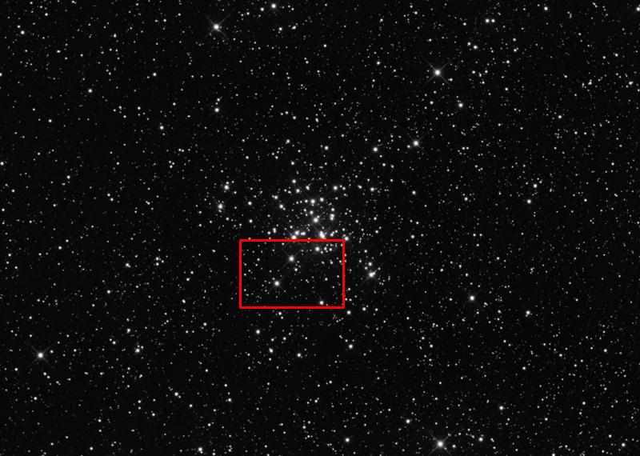 
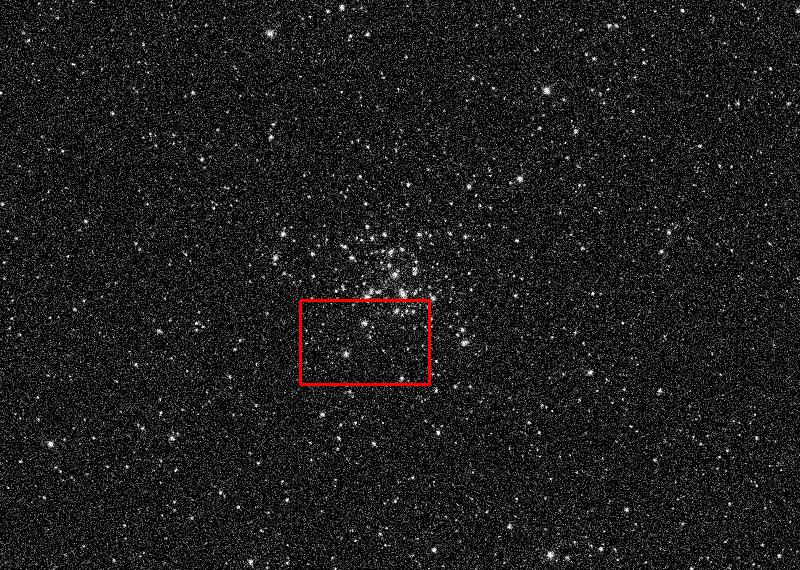  
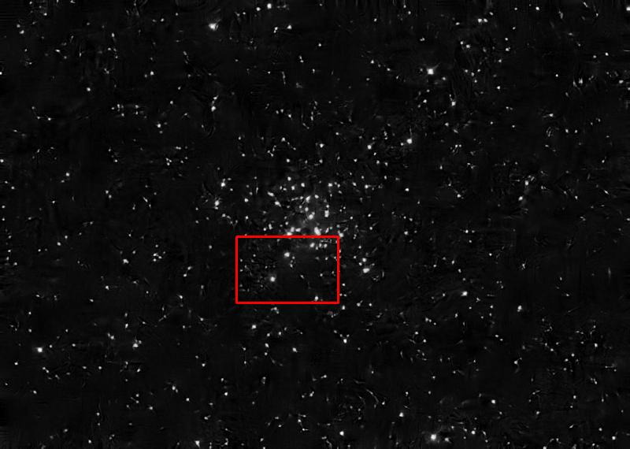 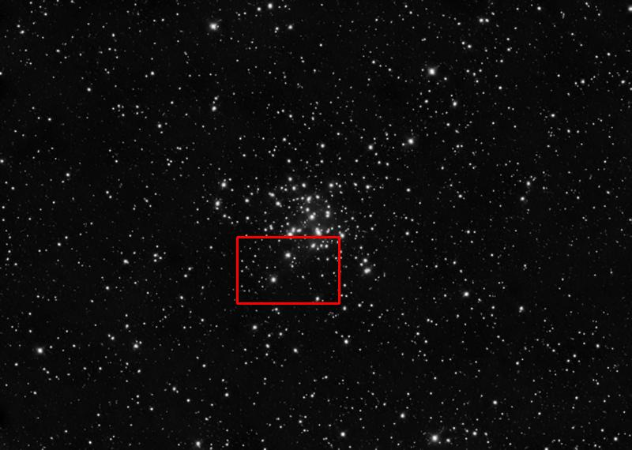 
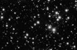 &ensp;  
 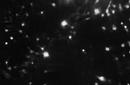 
   
&emsp; *training image* &emsp; &emsp; &emsp; &emsp; clean &emsp; &emsp; &emsp; &ensp; noisy with &sigma; = 50 &emsp; &emsp; &ensp; DnCNN 
&emsp; &emsp; &emsp; &emsp; &nbsp; LIDIA (ours) &emsp; &emsp; &emsp; adaptation 
<br /> &emsp; &emsp; &emsp; &emsp; &emsp; &emsp; &emsp; &emsp; &emsp; &emsp; &emsp; &emsp; &emsp; &emsp; &emsp; &emsp; &emsp; &emsp; &emsp; &emsp; &emsp; &emsp; &emsp; 
&ensp; PSNR = 27.05dB &emsp; &ensp; PSNR = 26.44dB &emsp; &ensp; PSNR = 28.04dB

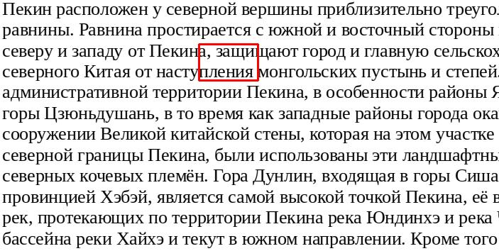 &ensp;  
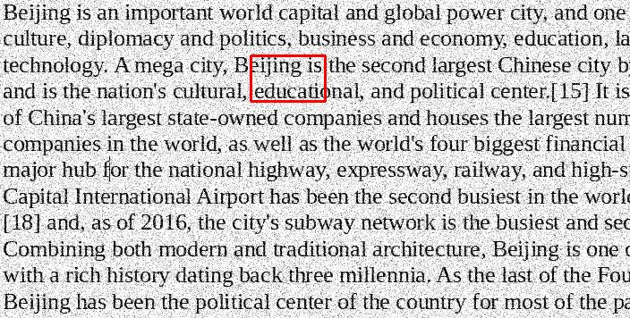 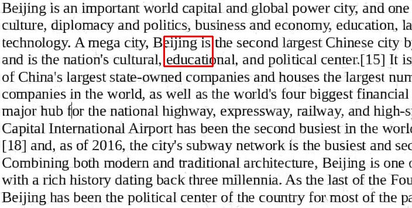 
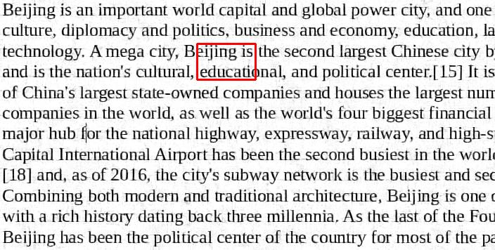  
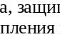 &ensp; 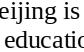 
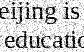 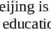 
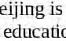   
&emsp; *training image* &emsp; &emsp; &emsp; &emsp; clean &emsp; &emsp; &emsp; &ensp; noisy with &sigma; = 50 &emsp; &emsp; &ensp; DnCNN 
&emsp; &emsp; &emsp; &emsp; &nbsp; LIDIA (ours) &emsp; &emsp; &emsp; adaptation 
<br /> &emsp; &emsp; &emsp; &emsp; &emsp; &emsp; &emsp; &emsp; &emsp; &emsp; &emsp; &emsp; &emsp; &emsp; &emsp; &emsp; &emsp; &emsp; &emsp; &emsp; &emsp; &emsp; &emsp; 
&ensp; PSNR = 23.33dB &emsp; &ensp; PSNR = 22.52dB &emsp; &ensp; PSNR = 26.78dB

## Internal Adaptation Results

In contrast to external adaptation, the internal one becomes effective when the incoming image is characterized by a high level of self-similarity. 
For example, applying internal adaptation on images from Urban100 gains a notable improvement of almost 0.3dB in PSNR on average.

#### Internal adaptation for Urban100 color images (&sigma; = 50)

| DnCNN | LIDIA (ours) |  LIDIA (ours) with adaptation |
|:-------:|:-------:|:-------:|
| 28.16 | 28.23 | 28.52 |

The internal adaptation can improve the denoising capability of the network, but the benefit varies significantly from image to another,
depending on its content.

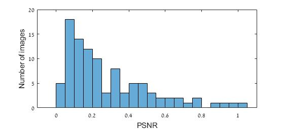  

&emsp; &emsp; &emsp; **Histogram of improvement per image for Urban100 set (&sigma; = 50)**

Note that the internal adaptation procedure is not always successful. However, failures usually do not cause performance degradation, 
indicating that this procedure, in the context of being deployed on a lightweight network, do not overfit.

### Some Qualitative Results

  
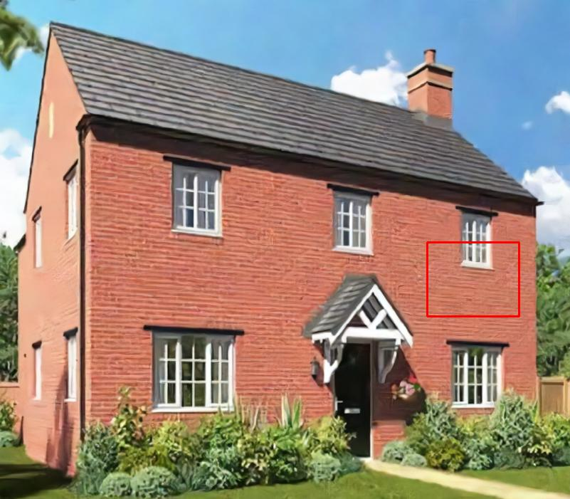 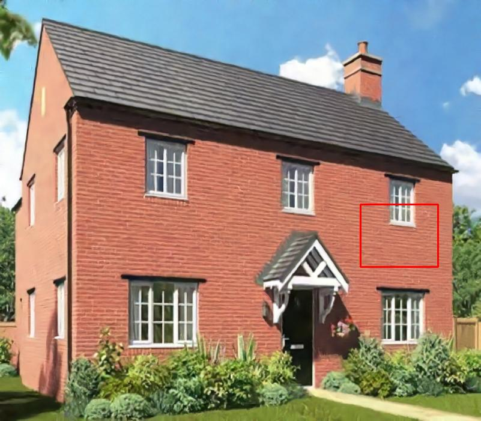 
 
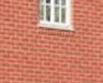 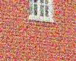 
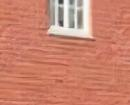 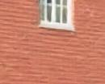 
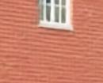  
&emsp; &emsp; &emsp; &ensp; clean &emsp; &emsp; &emsp; &emsp; &emsp; noisy with &sigma; = 50 &emsp; &emsp; &emsp; &emsp; DnCNN 
&emsp; &emsp; &emsp; &emsp; &emsp; &emsp; LIDIA (ours) &emsp; &emsp; &emsp; &emsp; &ensp; adaptation 
<br /> &emsp; &emsp; &emsp; &emsp; &emsp; &emsp; &emsp; &emsp; &emsp; &emsp; &emsp; &emsp; &emsp; &emsp; &emsp; &emsp; &emsp; &emsp; &emsp; &ensp; 
PSNR = 28.64dB &emsp; &emsp; &emsp; &nbsp; PSNR = 28.77dB &emsp; &emsp; &emsp; PSNR = 29.28dB

### Citation
If you use this code for your research, please cite our paper:

```
@InProceedings{Vaksman_2020_CVPR_Workshops,
  author = {Vaksman, Gregory and Elad, Michael and Milanfar, Peyman},
  title = {LIDIA: Lightweight Learned Image Denoising With Instance Adaptation},
  booktitle = {The IEEE/CVF Conference on Computer Vision and Pattern Recognition (CVPR) Workshops},
  month = {June},
  year = {2020}
}
```
# Code

This code was tested with python 3.8, cuda 10.2 and pytorch 1.5.0 on GeForse GTX 1080 Ti.

## Dependencies
- numpy
- matplotlib
- imageio
- Pillow
- torch
- torchvision

### Install dependencies:

``` 
python -m pip install -r code/dependencies.txt
```

## Color Image Denoising

### Denoise a Color Image

```
python code/denoise_rgb.py --in_path <in_path> --out_path <out_path> --sigma <sigma> [--cuda] [--plot] [--save]
```

#### Parameters

- **in_path** - path to the test image. Default: *images/BSD68/color/119082.png*
- **out_path** - path to the output image. Default: *output/119082_s15_out.png*
- **sigma** - noise sigma: {*15*, *25*, *50*}. Default: *15*
- **[--cuda]** (optional) - use GPU
- **[--plot]** (optional) - plot the processed image in a figure
- **[--save]** (optional) - save the output image

#### For demo run

```
python code/denoise_rgb.py --cuda --plot
```

### Denoise a Color Image Set

```
python code/denoise_set_rgb.py --in_path <in_path> --out_path <out_path> --sigma <sigma> [--cuda] [--plot] [--save]
```

#### Parameters

- **in_path** - path to the test set. Default: *images/BSD68/color/*
- **out_path** - path to the output set. Default: *output/*
- **sigma** - noise sigma: {*15*, *25*, *50*}. Default: *15*
- **[--cuda]** (optional) - use GPU
- **[--plot]** (optional) - plot the processed images in a figure
- **[--save]** (optional) - save the output images

#### For denoising color BSD68 set run

```
python code/denoise_set_rgb.py --cuda --save
```

#### For denoising color urban100 set run

```
python code/denoise_set_rgb.py --in_path images/urban100/color/ --save
```

## Grayscale Image Denoising

### Denoise a Grayscale Image

```
python code/denoise_bw.py --in_path <in_path> --out_path <out_path> --sigma <sigma> [--cuda] [--plot] [--save]
```

#### Parameters

- **in_path** - path to the test image. Default: *images/BSD68/color/test011.png*
- **out_path** - path to the output image. Default: *output/test011_s15_out.png*
- **sigma** - noise sigma: {*15*, *25*, *50*}. Default: *15*
- **[--cuda]** (optional) - use GPU
- **[--plot]** (optional) - plot the processed image in a figure
- **[--save]** (optional) - save the output image  


#### For demo run

```
python code/denoise_bw.py --cuda --plot
```

### Blind Denoising of a Grayscale Image

```
python code/blind_denoise_bw.py --in_path <in_path> --out_path <out_path> --sigma <sigma> [--cuda] [--plot] [--save]
```

#### Parameters

- **in_path** - path to the noisy image. Default: *images/BSD68/color/test011.png*
- **out_path** - path to the output image. Default: *output/test011_s15_out.png*
- **sigma** - noise sigma: {between *10* and *30*}. Default: *15*
- **[--cuda]** (optional) - use GPU
- **[--plot]** (optional) - plot the processed image in a figure
- **[--save]** (optional) - save the output image  

#### For demo run

```
python code/blind_denoise_bw.py --cuda --plot
```

### Denoise a Grayscale Image with a Small Network

```
python code/denoise_bw_small.py --in_path <in_path> --out_path <out_path> --sigma <sigma> [--cuda] [--plot] [--save]
```

#### Parameters

- **in_path** - path to the test image. Default: *images/BSD68/color/test011.png*
- **out_path** - path to the output image. Default: *output/test011_s15_out.png*
- **sigma** - noise sigma: {*15*, *25*, *50*}. Default: *15*
- **[--cuda]** (optional) - use GPU
- **[--plot]** (optional) - plot the processed image in a figure
- **[--save]** (optional) - save the output image

#### For demo run

```
python code/denoise_bw_small.py --cuda --plot
```

### Blind Denoising of a Grayscale Image with a Small Network

```
python code/blind_denoise_bw_small.py --in_path <in_path> --out_path <out_path> --sigma <sigma> [--cuda] [--plot] [--save]
```

#### Parameters

- **in_path** - path to the test image. Default: *images/BSD68/color/test011.png*
- **out_path** - path to the output image. Default: *output/test011_s15_out.png*
- **sigma** - noise sigma: {between *10* and *30*}. Default: *15*
- **[--cuda]** (optional) - use GPU
- **[--plot]** (optional) - plot the processed image in a figure
- **[--save]** (optional) - save the output image

#### For demo run

```
python code/blind_denoise_bw_small.py --cuda --plot
```

### Denoise a Grayscale Image Set

```
python code/denoise_set_bw.py --in_path <in_path> --out_path <out_path> --sigma <sigma> [--cuda] [--plot] [--save]
```

#### Parameters

- **in_path** - path to the test set. Default: *images/BSD68/gray/*
- **out_path** - path to the output set. Default: *output/*
- **sigma** - noise sigma: {*15*, *25*, *50*}. Default: *15*
- **[--cuda]** (optional) - use GPU
- **[--plot]** (optional) - plot the processed images in a figure
- **[--save]** (optional) - save the output images

#### For denoising garyscale BSD68 set run

```
python code/denoise_set_bw.py --cuda --save
```

#### For denoising garyscale urban100 set run

```
python code/denoise_set_bw.py --in_path images/urban100/gray/ --save
```

### Bling Denoising of a Grayscale Image Set

```
python code/blind_denoise_set_bw.py --in_path <in_path> --out_path <out_path> --sigma <sigma> [--cuda] [--plot] [--save]
```

#### Parameters

- **in_path** - path to the test set. Default: *images/BSD68/gray/*
- **out_path** - path to the output set. Default: *output/*
- **sigma** - noise sigma: {between *10* and *30*}. Default: *15*
- **[--cuda]** (optional) - use GPU
- **[--plot]** (optional) - plot the processed images in a figure
- **[--save]** (optional) - save the output images

#### For blind denoising BSD68 set run

```
python code/blind_denoise_set_bw.py --cuda --save
```

#### For blind denoising Urban100 set run

```
python code/blind_denoise_set_bw.py --in_path images/urban100/gray/ --save
```

### Denoise a Grayscale Image Set with a Small Network

```
python code/denoise_set_bw_small.py --in_path <in_path> --out_path <out_path> --sigma <sigma> [--cuda] [--plot] [--save]
```

#### Parameters

- **in_path** - path to the test set. Default: *images/BSD68/gray/*
- **out_path** - path to the output set. Default: *output/*
- **sigma** - noise sigma: {*15*, *25*, *50*}. Default: *15*
- **[--cuda]** (optional) - use GPU
- **[--plot]** (optional) - plot the processed images in a figure
- **[--save]** (optional) - save the output images

#### For denoising BSD68 set with small network run

```
python code/denoise_set_bw_small.py --cuda --save
```

#### For denoising Urban100 set with small network run

```
python code/denoise_set_bw_small.py --in_path images/urban100/gray/ --save
```

### Bling Denoising of a Grayscale Image Set with a Small Network

```
python code/blind_denoise_set_bw_small.py --in_path <in_path> --out_path <out_path> --sigma <sigma> [--cuda] [--plot] [--save]
```

#### Parameters

- **in_path** - path to the test set. Default: *images/BSD68/gray/*
- **out_path** - path to the output set. Default: *output/*
- **sigma** - noise sigma: {between *10* and *30*}. Default: *15*
- **[--cuda]** (optional) - use GPU
- **[--plot]** (optional) - plot the processed images in a figure
- **[--save]** (optional) - save the output images

#### For blind denoising BSD68 set with small network run

```
python code/blind_denoise_set_bw_small.py --cuda --save
```

#### For blind denoising Urban100 set with small network run

```
python code/blind_denoise_set_bw_small.py --in_path images/urban100/gray/ --save
```

## Internal Adaptation

### Run Internal Adaptation Experiment on a Color Image

```
python code/internal_adaptation_rgb.py --in_path <in_path> --out_path <out_path> --sigma <sigma> [--cuda_retrain] [--cuda_denoise] [--plot] [--save]
```

#### Parameters

- **in_path** - path to the test image. Default: *images/brick_house/color/test1_color.png*
- **out_path** - path to the output image. Default: *output/*
- **sigma** - noise sigma: {*15*, *25*, *50*}. Default: *50*
- **[--cuda_retrain]** (optional) - use GPU in the retraining stage
- **[--cuda_denoise]** (optional) - use GPU in the denoising stage
- **[--plot]** (optional) - plot the processed image in a figure
- **[--save]** (optional) - save the adapted network and output image

#### For demo run

```
python code/internal_adaptation_rgb.py --cuda_retrain --plot
```

### Run Internal Adaptation Experiment on a Grayscale Image

```
python code/internal_adaptation_bw.py --in_path <in_path> --out_path <out_path> --sigma <sigma> [--cuda_retrain] [--cuda_denoise] [--plot] [--save]
```

#### Parameters

- **in_path** - path to the test image. Default: = *images/brick_house/gray/test1_bw.png*
- **out_path** - path to the output image. Default: *output/*
- **sigma** - noise sigma: {*15*, *25*, *50*}. Default: *50*
- **[--cuda_retrain]** (optional) - use GPU in the retraining stage
- **[--cuda_denoise]** (optional) - use GPU in the denoising stage
- **[--plot]** (optional) - plot the processed image in a figure
- **[--save]** (optional) - save the adapted network and output image

#### For demo run

```
python code/internal_adaptation_bw.py --cuda_retrain --plot
```

### Run Internal Adaptation Experiment on a Color Image Set 

Runs internal adaptation experiment on each image in a set of color images

```
python code/internal_adaptation_set_rgb.py --in_path <in_path> --out_path <out_path> --sigma <sigma> [--cuda_retrain] [--cuda_denoise] [--plot] [--save]
```

#### Parameters

- **in_path** - path to the test set. Default: *images/urban100/color/*
- **out_path** - path to the output set. Default: *output/*
- **sigma** - noise sigma: {*15*, *25*, *50*}. Default: *50*
- **[--cuda_retrain]** (optional) - use GPU in the retraining stage
- **[--cuda_denoise]** (optional) - use GPU in the denoising stage
- **[--plot]** (optional) - plot the processed images in a figure
- **[--save]** (optional) - save the adapted network and output images

#### For internal adaptation experiment on color Urban100 set run

```
python code/internal_adaptation_set_rgb.py --cuda_retrain --save
```

#### For internal adaptation experiment on color BSD68 set run

```
python code/internal_adaptation_set_rgb.py --in_path images/BSD68/color/ --cuda_retrain --cuda_denoise --save
```

### Run Internal Adaptation Experiment on a Grayscale Image Set

Runs internal adaptation experiment on each image in a set of grayscale images

```
python code/internal_adaptation_set_bw.py --in_path <in_path> --out_path <out_path> --sigma <sigma> [--cuda_retrain] [--cuda_denoise] [--plot] [--save]
```

#### Parameters

- **in_path** - path to the test set. Default: *images/urban100/gray/*
- **out_path** - path to the output set. Default: *output/*
- **sigma** - noise sigma: {*15*, *25*, *50*}. Default: *50*
- **[--cuda_retrain]** (optional) - use GPU in the retraining stage
- **[--cuda_denoise]** (optional) - use GPU in the denoising stage
- **[--plot]** (optional) - plot the processed images in a figure
- **[--save]** (optional) - save the adapted network and output images

#### For internal adaptation experiment on grayscale Urban100 set run

```
python code/internal_adaptation_set_bw.py --cuda_retrain --save
```

#### For internal adaptation experiment on grayscale BSD68 set run

```
python code/internal_adaptation_set_bw.py --in_path images/BSD68/gray/ --cuda_retrain --cuda_denoise --save
```

## External Adaptation

### Run External Adaptation Experiment on a Color Image

```
python code/external_adaptation_rgb.py --in_path <in_path> --train_path <train_path> --out_path <out_path> --sigma <sigma> [--cuda_retrain] [--cuda_denoise] [--plot] [--save]
```

- **in_path** - path to the test image. Default: *images/astronomical/color/test/m36.png*
- **train_path** - path to the training image. Default: *images/astronomical/color/test/m38.png*
- **out_path** - path to the output image. Default: *output/*
- **sigma** - noise sigma: {*15*, *25*, *50*}. Default: *50*
- **[--cuda_retrain]** (optional) - use GPU in the retraining stage
- **[--cuda_denoise]** (optional) - use GPU in the denoising stage
- **[--plot]** (optional) - plot the processed image in a figure
- **[--save]** (optional) - save the adapted network and output image

#### For demo run

```
python code/external_adaptation_rgb.py --cuda_retrain --plot
```

### Run External Adaptation Experiment on a Grayscale Image

```
python code/external_adaptation_bw.py --in_path <in_path> --train_path <train_path> --out_path <out_path> --sigma <sigma> [--cuda_retrain] [--cuda_denoise] [--plot] [--save]
```

- **in_path** - path to the test image. Default: *images/astronomical/gray/test/m36.png*
- **train_path** - path to the training image. Default: *images/astronomical/gray/test/m38.png*
- **out_path** - path to the output image. Default: *output/*
- **sigma** - noise sigma: {*15*, *25*, *50*}. Default: *50*
- **[--cuda_retrain]** (optional) - use GPU in the retraining stage
- **[--cuda_denoise]** (optional) - use GPU in the denoising stage
- **[--plot]** (optional) - plot the processed image in a figure
- **[--save]** (optional) - save the adapted network and output image

#### For demo run

```
python code/external_adaptation_bw.py --cuda_retrain --plot
```


